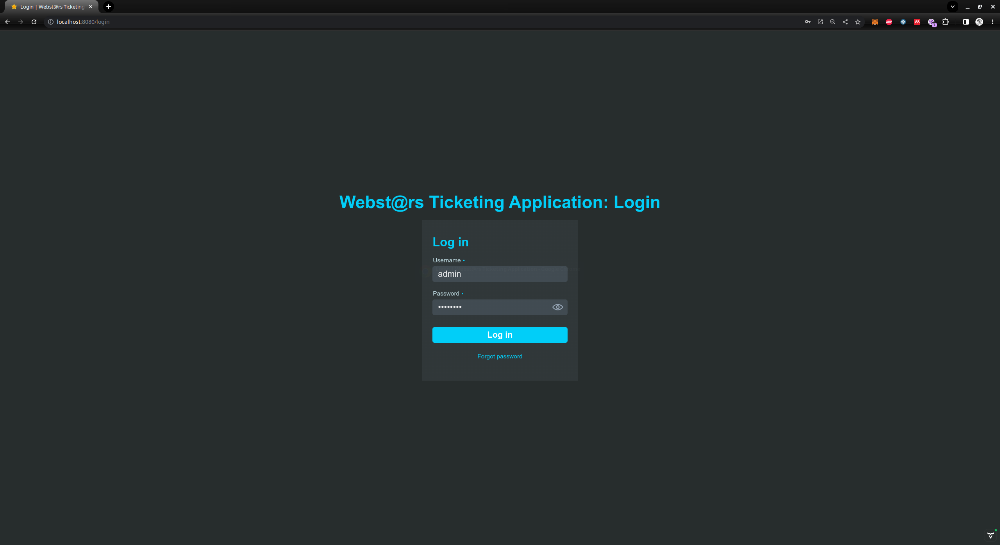
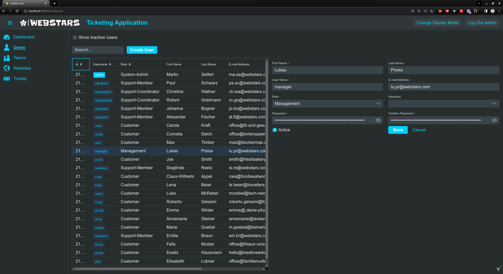
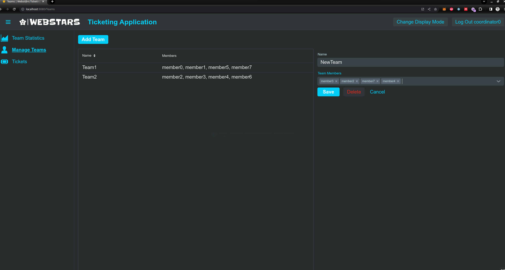
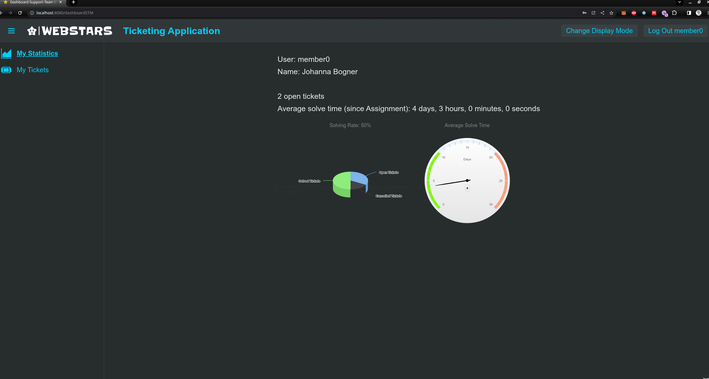
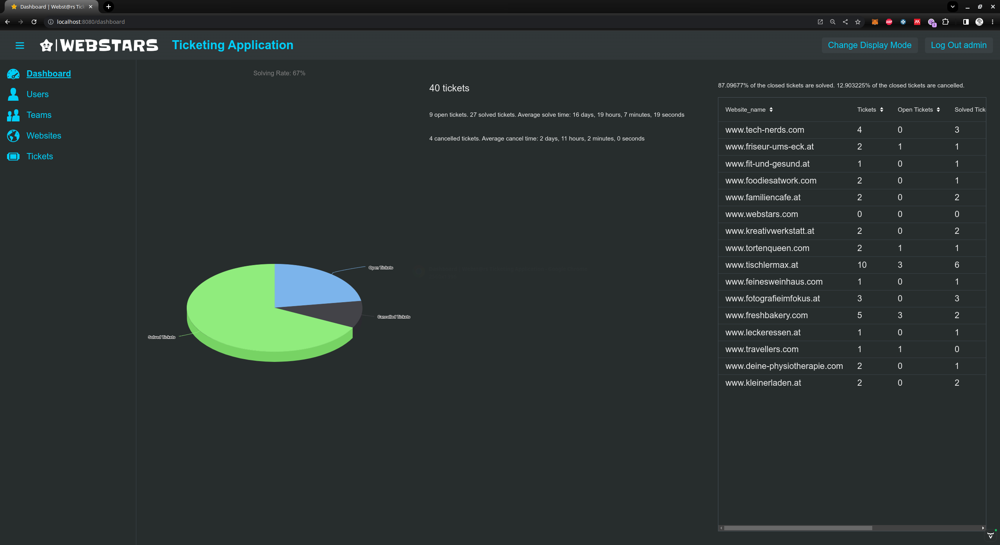
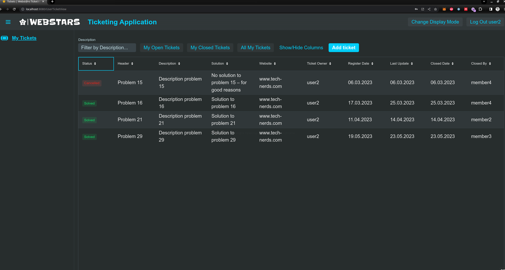

# Vaadin Issue Tracking Web-Application

The Issue Tracking Application is a tool designed to manage and track issues and tasks
in software development, and maintenance projects for our webdevelopement company Webstars GmbH.
This application is built to be robust, user-friendly, and efficient in managing the
workflow of issues.

### Requirements

For end users, all you need is a modern web browser such as Google Chrome, Mozilla Firefox,
Safari, or Microsoft Edge and an internet connection.

## Usage
-[Our Webapp](https://vaadin-ui-service-fdx3dx7jqa-oa.a.run.app/)   

Once you've installed a modern Webbrowser and connected to the internet, you can open this [link](https://vaadin-ui-service-fdx3dx7jqa-oa.a.run.app/)  
in the web browser of your choice.
From there, you can login with one of the following credentials. The web app provides
a role-specific set of views and features for each role.  

### System Admin:  
  - Username: admin
  - Password: password  
#### Views/Features for System-Admin:
- List of all tickets (+ Filter/Sort/Search)  
- Create new ticket  
- Detailed ticket view
- Dashboard statistics
- Alerts
- List of users
- Add/manage user

### Support-Coordinator:
- Username: coordinator0
- Password: password
#### Views/Features for Support-Coordinator:
- List of all tickets (+ Filter/Sort/Search)  
- Highlight list: unassigned tickets  
- Create new ticket
- Detailed ticket view
- Dashboard statistics
- Alerts

### Support-Member:
- Username: member0
- Password: password
#### Views/Features for Support-Member:  
- List of tickets assigned to Support-Member (+ Filter/Sort/Search)  
- Highlight list: newly received tickets  
- Create new ticket  
- Detailed ticket view  
- Dashboard statistics  
- Alerts  

### Project Management:  
- Username: manager  
- Password: password  
#### Views/Features for Management:
- Dashboard statistics
- Create new ticket

### Customer:
- Username: user2
- Password: password  
#### Views/Features for Customer:
- Create new ticket
- List of own tickets (+ Filter/Sort/Search)
- Detailed ticket view  

## Contributing

Contributions are always welcome! Please read the following instructions before making any changes:

1. Make sure you have a GitHub account.
2. Fork the repository on GitHub.
3. Make a clone of your fork on your local machine using `git clone`.
4. Create a new branch in your local clone for your changes. Name the branch something descriptive, such as `add-new-feature`.
5. Make your changes in the new branch. Please make sure to follow the existing coding style.
6. Test your changes to make sure they work correctly and don't introduce new bugs.
7. Commit your changes in your branch, then push your branch to your fork on GitHub.
8. Create a pull request from your branch to the main repository.

For contributing, you will need:

- A modern operating system (Windows 10, MacOS X, Linux)
- [Node.js](https://nodejs.org) (Version 14.0 or higher)
- A connection to a [Cloud SQL](https://cloud.google.com/sql) database

## Installation guidance (for Contributors)

1. Clone the repository to your local machine:

`git clone https://github.com/WebStars-GmbH/Issue-Tracking-Application.git`

2. Navigate into the project's directory:  
   `cd Issue-Tracking-Application`

3. Install the dependencies with maven:  
   `mvn install`

4.  In the application.properites change the  Cloud SQL connection string:  
   `DB_CONNECTION_STRING=postgres://<username>:<password>@<host>:<port>/<database>`  
We will provide you with the connection string on request

5. Start the application with your IDE:
    `mvn Application start`   
   The application should now be running on http://localhost:3000

6. Make sure all tests pass:  
   `mvn test`

7. Start making your changes in a new branch:
   `git checkout -b your-branch-name`

## Contributors

We would like to thank the following people who have founded, conceptualized, and fully implemented this project:

- [Boden Johanna](https://github.com/orgs/WebStars-GmbH/people/HonigUndErde) 20%
- [Goller Robert](https://github.com/orgs/WebStars-GmbH/people/the-official-robert) 20%
- [Prenner Lukas](https://github.com/prennerproducts) 20%
- [Seppi Martin](https://github.com/orgs/WebStars-GmbH/people/Zetamasevt) 20%
- [Wagner Christine](https://github.com/orgs/WebStars-GmbH/people/HoepfnerUndMalz) 20%

## License

This project is licensed under the terms of the GNU General Public License v3.0. For the terms of this license, refer to the [LICENSE](LICENSE.txt) file.
